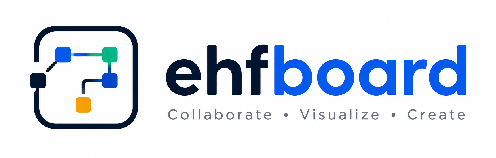

<div align="center">
  
  <h1 align="center">EHF Board</h1>
  <p align="center">
    All-in-one visual workspace — Whiteboard, Flowchart & ER Diagram tool
    <br />
    by <strong>Wholabs</strong>
    <br />
    <a href="https://ehf-board.vercel.app"><strong>Live Demo »</strong></a>
  </p>
</div>

<p align="center">
  
  
  
  
  
  
  
</p>

---

## ✨ Features

- **🎨 Whiteboard** — Free-form drawing canvas powered by tldraw. Sketch ideas, write notes, and visualize freely.
- **🔀 Flowchart** — Create professional flowcharts with Process, Decision, Start/End, Data, and Input/Output nodes. Connect them with animated edges.
- **🗄️ ER Diagram** — Design entity-relationship diagrams with customizable tables, fields, primary/foreign keys, and relationships.
- **💾 Auto-save** — Projects are automatically saved to browser localStorage as you work.
- **📦 Export / Import** — Export your project as JSON and import it later or share it with others.
- **🎯 Node customization** — Edit labels, colors, and table fields directly on the canvas.
- **📱 Responsive sidebar** — Toggle sidebar visibility for more canvas space.

## 🚀 Quick Start

```bash
# Clone the repository
git clone https://github.com/yourusername/ehf-board.git
cd ehf-board

# Install dependencies
npm install

# Start development server
npm run dev
```

Open [http://localhost:5173](http://localhost:5173) in your browser.

### Build for production

```bash
npm run build
npm run preview
```

## 🧰 Tech Stack

| Tech | Purpose |
|---|---|
| **React 19** | UI framework |
| **Vite 8** | Build tool & dev server |
| **tldraw 4** | Whiteboard canvas engine |
| **ReactFlow 11** | Flowchart & ERD canvas engine |
| **Zustand 5** | Lightweight state management |
| **Tailwind CSS 3** | Utility-first styling |
| **UUID** | Unique ID generation |

## 🏗️ Project Structure

```
src/
├── components/
│   ├── nodes/            # Custom ReactFlow node components
│   │   ├── ErdNode.jsx       # ERD table node
│   │   ├── FlowNode.jsx      # Flowchart node
│   │   └── FlowNode_old.jsx  # Legacy
│   ├── ERDCanvas.jsx         # ERD canvas wrapper
│   ├── FlowCanvas.jsx        # Flowchart canvas wrapper
│   ├── PresentationCanvas.jsx # Presentation mode (placeholder)
│   ├── Sidebar.jsx           # Mode switcher & tool panel
│   ├── TextFormattingPanel.jsx # Text styling panel
│   ├── Topbar.jsx            # Top toolbar with actions
│   ├── WhiteboardCanvas.jsx  # Whiteboard canvas wrapper
│   └── WhiteboardTools.jsx   # Whiteboard tool options
├── hooks/
│   └── useStore.js           # Zustand global store
├── utils/
│   └── storage.js            # localStorage & export/import
├── assets/
│   └── ...                   # Static assets
├── App.jsx                   # Root component
├── main.jsx                  # Entry point
└── index.css                 # Global styles & Tailwind
```

## 🖥️ Usage

### Whiteboard Mode
Select **Whiteboard** from the sidebar to access the full tldraw drawing toolkit — pen, shapes, text, sticky notes, and more.

### Flowchart Mode
Switch to **Flowchart** mode to build process flows:
1. Click **+ Process**, **+ Decision**, **+ Start/End**, **+ Data**, or **+ Input/Output** from the sidebar
2. Drag between node handles to create connections
3. Select a node to edit its label or color
4. Use **Delete Selected** from the toolbar to remove nodes/edges

### ERD Mode
Switch to **ERD** mode to design database schemas:
1. Click **+ Add Table** to create a new table
2. Click on a table to edit its name, add/remove fields, and set key types (PK/FK)
3. Drag between table handles to define relationships
4. Use **Delete Selected** to remove tables or relationships

## 🌐 Deployment

The project is ready for deployment on **Vercel**:

[](https://vercel.com/new)

Or deploy manually:

```bash
npm install -g vercel
vercel --prod
```

## 📄 License

Distributed under the MIT License. See `LICENSE` for more information.

---

<div align="center">
  Built with ❤️ by <strong>Wholabs</strong> using React, tldraw & ReactFlow
</div>
